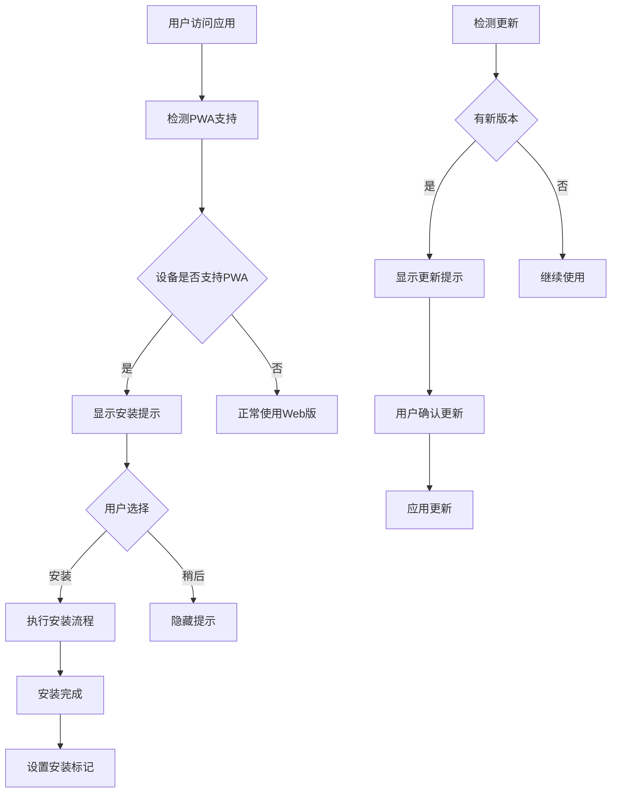
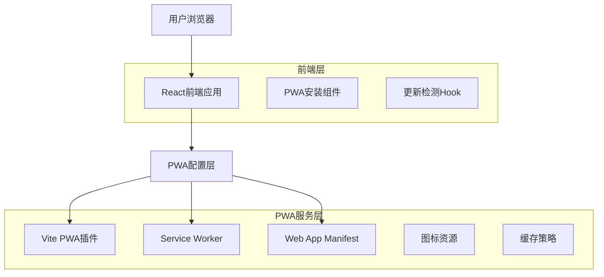

# 移动端PWA安装配置优化产品需求文档

## 1. 产品概述

薪资计算器是一款智能薪资计算工具，支持加班费计算、历史记录管理和数据可视化。为了提升移动端用户体验和应用安装率，需要对现有PWA配置进行系统性优化，解决当前存在的配置冗余、兼容性问题和用户体验不佳等问题。

## 2. 核心功能

### 2.1 用户角色

| 角色   | 注册方式      | 核心权限                     |
| ---- | --------- | ------------------------ |
| 普通用户 | 无需注册，直接使用 | 可使用所有计算功能、查看历史记录、安装PWA应用 |

### 2.2 功能模块

本次优化主要涉及以下页面的PWA安装体验：

1. **主页面**：PWA安装提示、应用图标展示
2. **安装引导页**：iOS/Android安装指导流程
3. **更新提示页**：Service Worker更新通知

### 2.3 页面详情

| 页面名称  | 模块名称    | 功能描述                              |
| ----- | ------- | --------------------------------- |
| 主页面   | PWA安装横幅 | 检测设备兼容性，显示个性化安装提示，支持一键安装或引导安装     |
| 主页面   | 应用图标管理  | 确保iOS/Android设备上图标显示正确，支持多种尺寸和格式  |
| 更新提示页 | 版本更新通知  | 检测Service Worker更新，提供用户友好的更新提示和操作 |

## 3. 核心流程

### 用户安装流程

用户访问应用 → 检测PWA兼容性 → 显示安装提示 → 用户选择安装方式 → 完成安装 → 设置安装标记

### 用户更新流程

检测到新版本 → 显示更新通知 → 用户确认更新 → 应用新版Service Worker → 刷新页面



## 4. 用户界面设计

### 4.1 设计风格

* **主色调**：紫色系 (#8b5cf6) 作为主色，白色 (#ffffff) 作为背景色

* **按钮样式**：圆角矩形，支持渐变效果和悬停动画

* **字体**：系统默认字体，标题使用 font-semibold，正文使用 text-sm

* **布局风格**：卡片式设计，响应式布局，支持移动端优化

* **图标风格**：使用 Lucide React 图标库，线性风格，统一尺寸

### 4.2 页面设计概览

| 页面名称 | 模块名称    | UI元素                               |
| ---- | ------- | ---------------------------------- |
| 主页面  | PWA安装横幅 | 紫色渐变背景，白色文字，圆角设计，包含应用图标、标题、描述和操作按钮 |
| 更新提示 | Toast通知 | 顶部滑入式通知，包含更新说明和操作按钮，自动消失或手动关闭      |

### 4.3 响应式设计

应用采用移动端优先的响应式设计，在不同屏幕尺寸下提供最佳的PWA安装体验。支持触摸交互优化，确保安装流程在各种移动设备上都能顺畅完成。

## 5. 技术架构

### 5.1 架构设计



### 5.2 技术描述

* **前端**: React\@18 + TypeScript + Tailwind CSS + Vite

* **PWA**: vite-plugin-pwa + Workbox

* **状态管理**: Zustand

* **UI组件**: Lucide React + 自定义组件

### 5.3 路由定义

| 路由 | 用途                 |
| -- | ------------------ |
| /  | 主页面，包含PWA安装提示和核心功能 |

## 6. 数据模型

### 6.1 PWA状态管理

```typescript
interface PWAState {
  isInstallable: boolean;     // 是否可安装
  isInstalled: boolean;       // 是否已安装
  canInstall: boolean;        // 是否支持安装
  updateAvailable: boolean;   // 是否有更新
  deferredPrompt: BeforeInstallPromptEvent | null;
}

interface InstallConfig {
  showPrompt: boolean;        // 是否显示安装提示
  promptDismissed: boolean;   // 是否已关闭提示
  installTime: number;        // 安装时间戳
  lastUpdateCheck: number;    // 最后更新检查时间
}
```

### 6.2 本地存储数据

```typescript
// localStorage 存储结构
interface LocalStorageData {
  'pwa-installed': 'true' | null;           // 安装状态标记
  'pwa-install-time': string;               // 安装时间
  'pwa-prompt-dismissed': 'true' | null;    // 提示关闭状态
  'pwa-last-update-check': string;          // 最后更新检查
}
```

## 7. 优化需求详情

### 7.1 配置管理优化

**问题描述**：当前项目中存在 `manifest.webmanifest` 文件和 `vite.config.ts` 中的 manifest 配置重复，可能导致配置不一致。

**解决方案**：

* 删除根目录下的 `manifest.webmanifest` 文件

* 将所有 PWA manifest 配置统一在 `vite.config.ts` 的 VitePWA 插件中管理

* 确保生产环境和开发环境的配置一致性

### 7.2 iOS图标兼容性增强

**问题描述**：当前使用 SVG 格式的 `apple-touch-icon`，虽然现代 iOS 支持良好，但为确保最佳兼容性，需要提供 PNG 格式备选。

**解决方案**：

* 在 `public` 目录下添加 `apple-touch-icon-180x180.png` 文件

* 在 `index.html` 中添加对应的 link 标签

* 保留 SVG 图标作为现代浏览器的优选方案

### 7.3 应用截图优化

**问题描述**：当前 `screenshots` 字段使用应用图标作为截图，无法有效展示应用功能。

**解决方案**：

* 制作 3-5 张展示核心功能的应用截图（建议尺寸 1080x1920）

* 截图内容包括：薪资计算界面、历史记录页面、图表分析页面

* 更新 manifest 配置中的 screenshots 字段

### 7.4 Service Worker更新策略优化

**问题描述**：当前 `skipWaiting` 设置为 `false`，用户需要关闭所有页面才能应用更新。

**解决方案**：

* 将 `skipWaiting` 设置为 `true`，`clientsClaim` 设置为 `true`

* 在 `usePWA.ts` 中实现更新检测和用户提示机制

* 提供用户友好的更新确认界面

### 7.5 iOS沉浸式体验提升

**问题描述**：当前状态栏样式为 `default`，可以优化为更沉浸的体验。

**解决方案**：

* 将 `apple-mobile-web-app-status-bar-style` 修改为 `black-translucent`

* 确保应用界面与状态栏的良好融合

* 测试不同 iOS 版本的兼容性

### 7.6 安装检测逻辑简化

**问题描述**：当前 `checkIfInstalled` 函数逻辑复杂，依赖多种检测方式。

**解决方案**：

* 优先使用 `window.matchMedia('(display-mode: standalone)').matches` 进行检测

* 简化 localStorage 依赖，提高检测准确性

* 减少不必要的兼容性检查

## 8. 验收标准

### 8.1 功能验收

* [ ] PWA 安装提示在 Chrome (Android/Desktop)、Safari (iOS)、Edge (Desktop) 上正常显示

* [ ] 安装后的应用图标在各平台显示正确，无白边或变形

* [ ] 应用截图在安装界面正确展示，能够吸引用户安装

* [ ] 发布新版本后，已安装用户能够收到更新提示

* [ ] iOS 设备上应用以沉浸式模式运行，状态栏样式正确

* [ ] 安装状态检测准确，无误报或漏报

### 8.2 性能验收

* [ ] Lighthouse PWA 评分达到 90 分以上

* [ ] 首次安装时间控制在 3 秒以内

* [ ] 图标资源总大小增加不超过 100KB

* [ ] Service Worker 更新检测响应时间小于 2 秒

### 8.3 兼容性验收

* [ ] iOS 14+ Safari 浏览器兼容性测试通过

* [ ] Android 8+ Chrome 浏览器兼容性测试通过

* [ ] Windows/macOS Edge 浏览器兼容性测试通过

* [ ] 不同屏幕尺寸设备的安装体验一致

## 9. 风险评估与对策

### 9.1 技术风险

| 风险项                 | 风险等级 | 影响描述       | 应对策略              |
| ------------------- | ---- | ---------- | ----------------- |
| iOS 新版本图标策略变化       | 中    | 可能导致图标显示异常 | 保留多种格式图标，定期测试新版本  |
| Service Worker 缓存冲突 | 低    | 可能影响更新机制   | 实施渐进式部署，充分测试缓存策略  |
| 浏览器 PWA 支持变化        | 中    | 可能影响安装功能   | 监控浏览器更新，及时调整兼容性代码 |

### 9.2 用户体验风险

| 风险项      | 风险等级 | 影响描述     | 应对策略             |
| -------- | ---- | -------- | ---------------- |
| 安装提示过于频繁 | 低    | 可能影响用户体验 | 实施智能提示策略，记录用户偏好  |
| 更新提示干扰使用 | 低    | 可能中断用户操作 | 选择合适的提示时机，提供延迟选项 |
| 图标尺寸不匹配  | 中    | 影响应用美观度  | 使用标准尺寸，多设备测试验证   |

## 10. 实施计划

### 10.1 开发阶段

| 阶段       | 时间 | 主要任务        | 交付物                    |
| -------- | -- | ----------- | ---------------------- |
| **第一阶段** | 1天 | 配置统一与图标制作   | 统一的 PWA 配置，新增 PNG 图标   |
| **第二阶段** | 2天 | 安装引导与更新机制开发 | 优化的安装组件，更新提示功能         |
| **第三阶段** | 1天 | 应用截图制作与集成   | 功能展示截图，更新的 manifest 配置 |
| **第四阶段** | 1天 | 多设备测试与调优    | 测试报告，性能优化结果            |

### 10.2 测试与发布

| 阶段       | 时间 | 主要任务            | 验收标准         |
| -------- | -- | --------------- | ------------ |
| **测试阶段** | 2天 | 功能测试、兼容性测试、性能测试 | 所有验收标准通过     |
| **灰度发布** | 3天 | 小范围用户测试，收集反馈    | 用户反馈良好，无严重问题 |
| **正式发布** | 1天 | 全量发布，监控数据       | 安装率提升，用户体验改善 |

## 11. 成功指标

### 11.1 核心指标

* **安装转化率**：移动端 PWA 安装率提升 30%

* **安装成功率**：PWA 安装成功率达到 95% 以上

* **更新响应率**：用户主动更新响应率达到 60% 以上

* **用户留存率**：安装用户的 7 日留存率提升 20%

### 11.2 技术指标

* **Lighthouse PWA 评分**：达到 90 分以上

* **首屏加载时间**：控制在 2 秒以内

* **安装包大小**：增加不超过 100KB

* **兼容性覆盖率**：主流移动浏览器兼容性达到 95%

### 11.3 用户体验指标

* **安装流程完成率**：用户完成安装流程的比例达到 80%

* **用户满意度**：通过用户反馈调研，满意度达到 4.5/5.0

* **问题反馈率**：PWA 相关问题反馈率低于 2%

* **功能使用率**：安装后用户的功能使用率提升 25%

