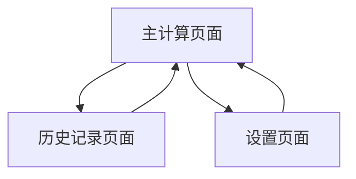

# 薪水计算应用需求文档

## 1. 产品概述
本产品是一个纯本地运行的薪水计算应用，提供简洁流畅的界面体验，支持多项薪资组成部分的计算和历史记录管理。
- 解决薪资计算复杂性问题，为需要精确计算多项薪资组成的用户提供便捷工具。
- 目标用户为需要定期计算薪资的个人用户或小型企业员工。

## 2. 核心功能

### 2.1 用户角色
本应用为单用户应用，无需区分用户角色。

### 2.2 功能模块
我们的薪水计算应用包含以下主要页面：
1. **主计算页面**：薪资项目输入区域、加班时长输入、实时计算显示、保存功能。
2. **历史记录页面**：历史薪资记录列表、记录详情查看、删除功能。
3. **设置页面**：加班费率设置、数据导出功能。

### 2.3 页面详情

| 页面名称 | 模块名称 | 功能描述 |
|----------|----------|----------|
| 主计算页面 | 基础薪资输入区 | 输入本薪、专业加给、餐补、夜班津贴、无尘衣津贴等固定金额 |
| 主计算页面 | 加班时长输入区 | 分别输入加班1、加班2、加班3的工作时长，自动按费率计算金额 |
| 主计算页面 | 实时计算显示区 | 实时显示各项金额和总薪资，清晰展示薪资构成明细 |
| 主计算页面 | 保存功能 | 保存当前计算结果到本地存储，包含时间戳和备注 |
| 历史记录页面 | 记录列表 | 显示所有历史薪资计算记录，按时间倒序排列 |
| 历史记录页面 | 记录详情 | 查看单条记录的详细薪资构成和计算时间 |
| 历史记录页面 | 删除功能 | 删除选中的历史记录 |
| 设置页面 | 费率设置 | 修改加班1（21元/小时）、加班2（28元/小时）、加班3（42元/小时）的费率 |
| 设置页面 | 数据管理 | 导出历史数据为CSV格式，清空所有历史记录 |

## 3. 核心流程

**主要操作流程：**
用户进入主计算页面 → 输入各项薪资基础金额 → 输入加班时长 → 系统自动计算总薪资 → 用户保存记录 → 可查看历史记录或调整设置。

## 4. 用户界面设计

### 4.1 设计风格（粘土拟态 Claymorphism）
- **主色调**：柔和紫色系（#8B5CF6, #A78BFA）和奶白色（#FEFEFE）
- **辅助色**：柔和粉色（#F472B6）、薄荷绿（#34D399）、珊瑚橙（#FB7185）用于不同功能区域
- **按钮样式**：高度圆角（border-radius: 20px+），厚重的内阴影和外阴影，营造3D立体效果
- **字体**：圆润字体，标题18px加粗，正文15px，小字13px，颜色对比度适中
- **布局风格**：浮动卡片设计，大圆角容器，柔和渐变背景，元素间距宽松
- **图标风格**：圆润可爱的图标，填充式设计，与整体风格保持一致
- **阴影效果**：多层次阴影，内凹外凸效果，模拟粘土质感
- **交互反馈**：按压时轻微下沉效果，悬停时轻微上浮

### 4.2 页面设计概览

| 页面名称 | 模块名称 | UI元素 |
|----------|----------|--------|
| 主计算页面 | 基础薪资输入区 | 柔和紫色背景的圆角卡片，内含圆润输入框，标签使用可爱字体，金额右对齐显示 |
| 主计算页面 | 加班时长输入区 | 薄荷绿色调的立体卡片，时长输入框带内凹效果，费率和结果实时更新显示 |
| 主计算页面 | 实时计算显示区 | 大型浮动卡片，总薪资用大号圆润字体突出显示，明细列表采用小卡片堆叠效果 |
| 主计算页面 | 保存功能 | 珊瑚橙色3D按钮，圆润造型，按压时下沉效果，成功后显示可爱动画提示 |
| 历史记录页面 | 记录列表 | 浮动卡片列表，每项带柔和阴影，日期和金额用不同色彩区分，卡通图标装饰 |
| 设置页面 | 费率设置 | 粉色调设置卡片，圆润输入框配合立体保存按钮，整体布局宽松舒适 |

### 4.3 响应式设计
应用采用桌面优先设计，支持移动端适配，考虑触摸交互优化。