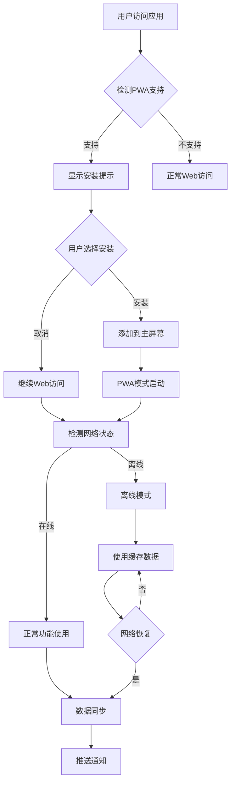

# 薪资计算应用PWA功能需求文档

## 1. 产品概览

本文档旨在为现有的薪资计算应用添加完整的PWA（Progressive Web App）功能支持，使其具备原生应用的体验和功能。PWA将提供离线访问、应用安装、推送通知、后台同步等核心特性，大幅提升用户体验和应用可用性。

通过PWA技术，用户可以像使用原生应用一样使用薪资计算工具，无论是在线还是离线环境下都能正常工作，并且可以直接安装到设备桌面或主屏幕。

## 2. 核心功能

### 2.1 用户角色

| 角色    | 使用方式      | 核心权限                  |
| ----- | --------- | --------------------- |
| 普通用户  | 直接访问PWA应用 | 可使用所有薪资计算功能、离线访问、数据同步 |
| 移动端用户 | 安装PWA到主屏幕 | 原生应用体验、推送通知、后台同步      |

### 2.2 功能模块

我们的PWA薪资计算应用包含以下主要功能模块：

1. **应用安装功能**：支持添加到主屏幕、桌面安装
2. **离线访问功能**：缓存策略、离线数据存储
3. **推送通知功能**：薪资提醒、数据同步通知
4. **后台同步功能**：数据备份、跨设备同步
5. **应用更新功能**：自动更新、版本管理
6. **性能优化功能**：资源预加载、懒加载
7. **安全功能**：HTTPS支持、数据加密

### 2.3 页面详情

| 页面名称    | 模块名称    | 功能描述                           |
| ------- | ------- | ------------------------------ |
| 安装提示页面  | 安装横幅    | 检测PWA安装条件，显示安装提示横幅，引导用户安装应用到设备 |
| 离线提示页面  | 网络状态检测  | 检测网络连接状态，在离线时显示友好提示，确保离线功能正常工作 |
| 通知设置页面  | 推送通知配置  | 配置推送通知权限，设置通知类型和频率，管理通知偏好      |
| 同步状态页面  | 数据同步管理  | 显示数据同步状态，手动触发同步，解决同步冲突         |
| 更新提示页面  | 应用更新管理  | 检测应用更新，提示用户更新，管理更新进度           |
| 缓存管理页面  | 存储空间管理  | 显示缓存使用情况，清理缓存数据，管理离线存储         |
| PWA设置页面 | PWA功能配置 | 统一管理所有PWA相关设置，包括通知、同步、缓存等配置    |

## 3. 核心流程

### 3.1 应用安装流程

用户首次访问应用时，系统检测PWA安装条件，如果满足条件则显示安装横幅。用户点击安装后，应用被添加到设备主屏幕或桌面，后续可以像原生应用一样启动。

### 3.2 离线使用流程

用户在有网络时正常使用应用，系统自动缓存关键资源和数据。当网络断开时，用户仍可访问已缓存的功能，进行薪资计算和查看历史记录。网络恢复后自动同步离线期间的数据变更。

### 3.3 推送通知流程

用户授权推送通知权限后，系统可以发送薪资提醒、数据同步完成等通知。用户可以在设置中自定义通知类型和频率。

## 4. 用户界面设计

### 4.1 设计风格

PWA功能的UI设计将延续现有应用的粘土拟态风格，确保视觉一致性：

* **主色调**：保持现有的紫色主题 (#8B5CF6) 和绿色辅助色 (#10B981)

* **按钮样式**：圆角按钮配合柔和阴影，体现粘土质感

* **字体**：Inter字体，14px-16px为主要字号

* **布局风格**：卡片式布局，顶部导航栏

* **图标风格**：使用Lucide图标库，配合PWA专用图标

* **动画效果**：平滑过渡动画，增强用户体验

### 4.2 页面设计概览

| 页面名称    | 模块名称 | UI元素                               |
| ------- | ---- | ---------------------------------- |
| 安装提示页面  | 安装横幅 | 粘土风格横幅卡片，包含应用图标、安装按钮、关闭按钮，使用紫色渐变背景 |
| 离线提示页面  | 网络状态 | 居中显示的状态卡片，包含离线图标、状态文字、重试按钮，使用灰色调色板 |
| 通知设置页面  | 推送配置 | 开关组件、选择器、设置卡片，使用绿色强调色表示启用状态        |
| 同步状态页面  | 同步管理 | 进度条、状态指示器、同步按钮，使用蓝色表示同步进行中         |
| 更新提示页面  | 更新管理 | 模态对话框、进度条、更新按钮，使用橙色表示有更新可用         |
| 缓存管理页面  | 存储管理 | 存储使用图表、清理按钮、存储详情列表，使用红色表示清理操作      |
| PWA设置页面 | 功能配置 | 分组设置卡片、开关组件、信息提示，保持整体紫色主题          |

### 4.3 响应式设计

PWA功能完全支持响应式设计，确保在各种设备上都有良好体验：

* **桌面端**：充分利用屏幕空间，侧边栏导航

* **平板端**：适配中等屏幕，保持功能完整性

* **手机端**：优化触摸交互，底部导航栏

* **PWA模式**：隐藏浏览器UI，提供原生应用体验

## 5. 技术实现要求

### 5.1 Service Worker

* 实现缓存策略（Cache First、Network First、Stale While Revalidate）

* 处理离线功能和后台同步

* 管理应用更新和版本控制

### 5.2 Web App Manifest

* 配置应用元数据（名称、图标、主题色等）

* 设置启动模式和显示方式

* 定义应用范围和起始URL

### 5.3 推送通知

* 集成Web Push API

* 实现通知权限管理

* 配置通知服务器端点

### 5.4 数据存储

* 使用IndexedDB进行离线数据存储

* 实现数据同步机制

* 处理存储空间管理

### 5.5 性能优化

* 实现资源预加载和懒加载

* 优化首屏加载时间

* 减少包体积和网络请求

## 6. 安全和隐私

### 6.1 HTTPS要求

* 确保所有PWA功能在HTTPS环境下运行

* 配置安全的Service Worker注册

### 6.2 数据加密

* 敏感数据本地加密存储

* 安全的数据传输机制

### 6.3 权限管理

* 合理请求用户权限

* 提供权限撤销机制

* 透明的数据使用说明

## 7. 兼容性和回退

### 7.1 浏览器支持

* 现代浏览器完整PWA功能

* 旧版浏览器优雅降级

* 提供功能检测和回退方案

### 7.2 设备支持

* iOS Safari PWA支持

* Android Chrome PWA支持

* 桌面浏览器PWA支持

## 8. 测试和部署

### 8.1 PWA测试

* Lighthouse PWA审核

* 离线功能测试

* 安装流程测试

* 推送通知测试

### 8.2 部署要求

* HTTPS部署环境

* Service Worker文件配置

* Manifest文件部署

* 推送服务配置

